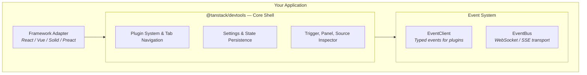

TanStack Devtools is a unified panel that runs multiple devtools plugins inside a single draggable shell. It supports first-party panels (Query, Router, Form) and custom plugins in the same UI, and includes the plugin system, event bus, and Vite integration needed to run them together.

> [!IMPORTANT]
> TanStack Devtools is currently in **alpha** and its API is subject to change.

## Why it exists

Building devtools UI from scratch requires trigger placement, panel state, drag behavior, z-index management, hotkeys, and plugin coordination. TanStack Devtools provides a shared shell for those responsibilities.

## Package layers

TanStack Devtools is composed of several packages organized into layers. Install the packages that match your use case.

### Package selection

- Building an app with existing panels: install one framework adapter and `@tanstack/devtools-vite`.
- Building custom plugins or lower-level integrations: add `@tanstack/devtools-event-client`, `@tanstack/devtools-event-bus`, and `@tanstack/devtools-utils` as needed.

<!-- ::start:tabs variant="package-manager" mode="install" -->
react: @tanstack/react-devtools @tanstack/devtools-vite
vue: @tanstack/vue-devtools @tanstack/devtools-vite
solid: @tanstack/solid-devtools @tanstack/devtools-vite
preact: @tanstack/preact-devtools @tanstack/devtools-vite
<!-- ::end:tabs -->

### Framework Adapters

- `@tanstack/react-devtools`
- `@tanstack/vue-devtools`
- `@tanstack/solid-devtools`
- `@tanstack/preact-devtools`

Thin wrappers that mount the devtools shell in your framework.

### Core

- `@tanstack/devtools` — The devtools shell UI built in Solid.js. Provides the plugin system, tab navigation, settings panel, and trigger button.

### Event System

- `@tanstack/devtools-event-client` — Type-safe event client for building custom plugins.
- `@tanstack/devtools-event-bus` — WebSocket/SSE transport layer connecting client and server.

### Build Tools

- `@tanstack/devtools-vite` — Vite plugin providing source inspection, console piping, enhanced logging, and production build stripping.

### Utilities

- `@tanstack/devtools-utils` — Plugin factory helpers for each framework.
- `@tanstack/devtools-ui` — Shared Solid.js UI component library.
- `@tanstack/devtools-client` — Internal typed event client for core devtools operations.

## Architecture

The diagram below shows how the layers connect:

This diagram is Mermaid source in the page, not a static image or SVG.

Three layers matter in practice:

- Framework adapter: apps mount one adapter package (`@tanstack/react-devtools`, `@tanstack/vue-devtools`, `@tanstack/solid-devtools`, or `@tanstack/preact-devtools`).
- Core shell (`@tanstack/devtools`): renders the trigger, panel, tabs, plugin containers, and settings.
- Event system (`@tanstack/devtools-event-client` and `@tanstack/devtools-event-bus`): handles typed plugin events and optional server transport over WebSocket/SSE.

## Capabilities

- **Framework agnostic**: React, Vue, Solid, and Preact adapters.
- **Plugin system & marketplace**: Build, share, and install devtools plugins with a simple API.
- **Typed events**: Communicate between plugins and the shell using fully typed events.
- **Source inspector**: Element-to-source navigation in development.
- **Console piping**: Browser and terminal log piping through the Vite plugin.
- **Picture-in-picture**: Panel rendering in a separate window.
- **Customizable hotkeys**: Configurable open and inspect shortcuts.

## Next Steps

- [Quick Start](./quick-start) — Get running in 2 minutes
- [Architecture Overview](./architecture) — Understand how the pieces fit together
- [Building Custom Plugins](./building-custom-plugins) — Create your own devtools
